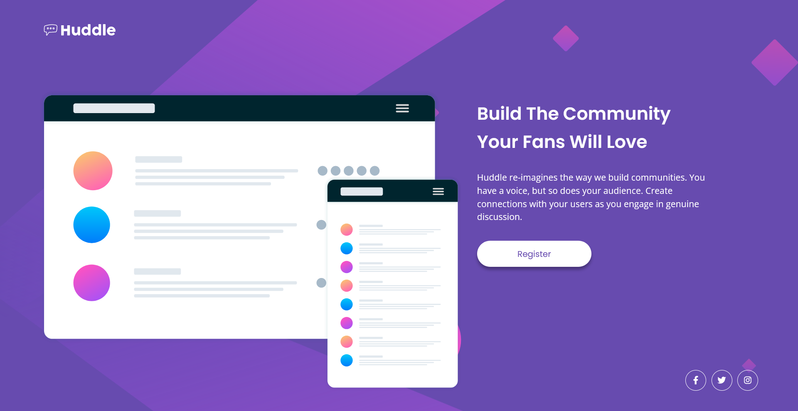

# Huddle Landing Page


## Links
- [Challenge Link](https://www.frontendmentor.io/challenges/huddle-landing-page-with-a-single-introductory-section-B_2Wvxgi0)
- [Site Preview](https://robinjmm-huddle-landing.netlify.app/)

## About
This is my solution for the challenge of building a landing page for a fictional company Huddle. The challenge is from [Frontendmentor.io](https://www.frontendmentor.io).

Doing this project was a nice break from all the JavaScript stuff and just focus on simple HTML and CSS work. Although the layout looks simple, there were some pretty tough challenges that surprised me. One of them was the positioning of the social icons. I had to figure out how to keep them fixed at the bottom of page. Another task that gave me a hard time was the background image. I had to deal with clipping issues when testing on larger screens. Luckily, I managed to solved it using the background-size property. As always, I plan to revisit this solution and improve it.

**Any feedback on how to improve my solution would be greatly appreciated**.

## User Stories
- View the optimal layout for the page depending on their device's screen size.
- See hover states for all interactive elements on the page.

## Built With
- Semantic HTML5
- CSS3
- Flexbox
- Sass

## Usage
You can download the project files by clicking on the green **Code** button, then select **Download Zip**.

Once you finish extracting, move into the project folder, open the terminal, and type the following code:

```
npm install
```

This will install all the required dependencies.

To compile Sass into CSS and watch for any future changes, type the following code in your terminal:


```
npm run sass
```

To compile Sass into a minified version of CSS, run:

```
npm run prod
```

## Acknowledgement
I'm very grateful to the people at [Frontendmentor.io](https://frontendmentor.io) for providing designs and challenges that help me improve my skills as a web developer.